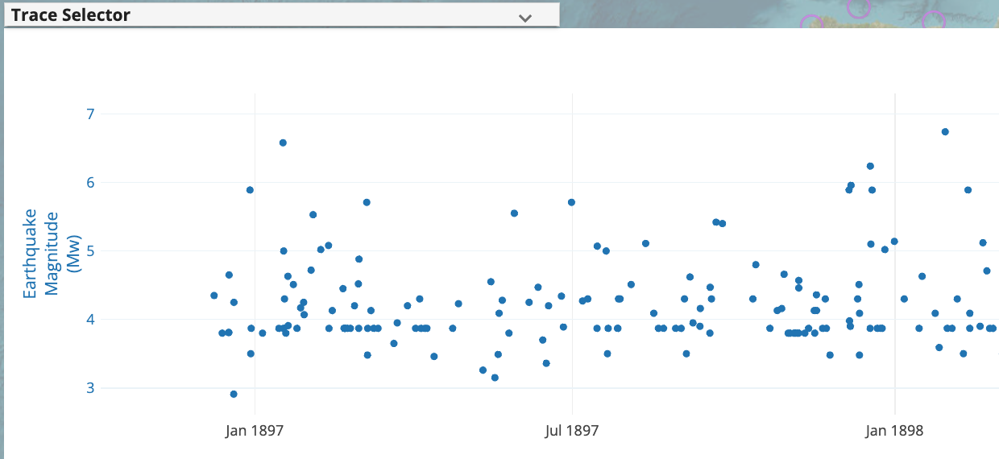

# Scatter Plot

The EPOS GUI supports displaying time series as scatter plots, enhancing the visualization of your data:



## Usage

To correctly display a CoverageJSON as a Scatter Plot, follow these steps:

1. **Add the `plotType` Attribute to the Desired Parameter**:
   - In your CoverageJSON payload, locate the `parameters` object.
   - For the parameter you wish to visualize as a scatter plot, add the `plotType` attribute.

   **Example**:

   ```json
   {
     "parameters": {
       "Magnitude": {
         "description": {
           "en": "The magnitude of the earthquake"
         },
         "observedProperty": {
           "id": "earthquake_magnitude",
           "label": {
             "en": "Earthquake Magnitude"
           }
         },
         "plotType": "https://www.data-to-viz.com/graph/scatter.html", // Add this
         "type": "Parameter",
         "unit": {
           "symbol": "Mw"
         }
       }
     }
   }
   ```

2. **Define Supported Plot Types**:
   - Currently, the EPOS GUI supports two plot types:
     1. **Scatter Plot**: Identified using `https://www.data-to-viz.com/graph/scatter.html`

        

     2. **Line Plot**: Identified using `https://www.data-to-viz.com/graph/line.html`

        

> If the `plotType` attribute is not explicitly specified for a parameter within the `parameters` object, the EPOS GUI will default to displaying the parameter using a **Line Plot**.
