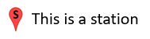
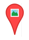
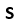
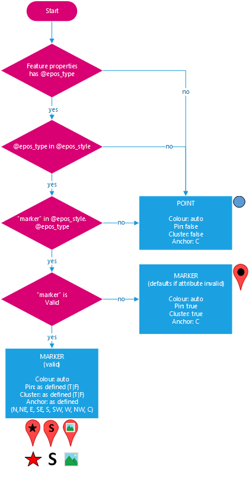
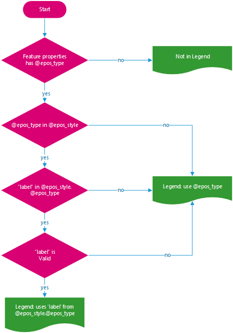

# EPOS GeoJSON

## Purpose

A number of work packages have requested additional features to be supported by the GUI. Currently, the GUI supports GeoJSON, but GeoJSON doesn't support the desired features. At this late stage, it has been deemed too risky to introduce another format and associated development effort; therefore, an alternative solution is to propose EPOS-specific extensions to the GeoJSON format.

## Requirements

| Requirement                | Description                                                                                                                       |
| -------------------------- | --------------------------------------------------------------------------------------------------------------------------------- |
| Map Markers                | The GeoJSON can optionally specify the styling and behaviour of map markers.                                                      |
| Image Overlays             | The GeoJSON can contain image references that will be displayed as overlays on the map (not geo-tiff).                            |
| Legends                    | Information derived from the Map Markers and Image Overlays can be used to generate map legends.                                  |
| Map Popup content          | The GeoJSON can express some control over the properties used to dynamically generate map popups.                                 |
| Data Visualisation Columns | The GeoJSON can express some control over the properties used to dynamically generate data visualisation columns.                 |
| Links                      | The GeoJSON properties can include additional information on (hyper)links to include in the map popups and/or data visualisation. |

## @epos JSON Objects

All new root JSON objects introduced to support EPOS functionality will be accessible via attribute names that start with `@epos_`. This is to avoid name clashes and false positives parsing the GeoJSON for EPOS specific information. All EPOS specific JSON objects are optional; if any are missing, sensible default behaviour will be followed, ensuring the raw GeoJSON can still be rendered.

```json
{
    "type": "FeatureCollection",
    "@epos_style": {
        ...
    },
    ...
}
```

## Styling

The styling of map markers and map legends for GeoJSON points is defined by the `@epos_style` object. The object contains attributes named such that they correspond to the value(s) of the `@epos_type` attribute defined within the `properties` objects of GeoJSON features.

### Example

In the example below there is a feature with an @epos_type = station, this matches the attribute station within the the @epos_style object, hence in this case stations would be rendered on the map as pins with an 's'


A corresponding legend would be generated, looking something like:



**feature:**

```json
"features": [
    {
        "type": "Feature",
        "properties": {
            "@epos_type": "station",//used to lookup @epos_style attributes
            ...
        }
    }
]
```

### style:

```json
"type": "FeatureCollection",
    "@epos_style": {
        //attribute names to match with @epos_type values
        "station": {
            "label": "This is a station", //use for legend
            "marker": {
                "character": "S", //character type value
                "pin": true, //true|false
                "clustering": true  //true|false
                //"anchor":"C"  not needed when pin=true
            }
        },
        ...
```

## Style Attributes

Each @epos_type defined in the @epos_style object defines the following:

| Attribute         | Description                                                                                                                               |
| ----------------- | ----------------------------------------------------------------------------------------------------------------------------------------- |
| label             | If provided, this is used as the text to associate with the map marker in the legend; else the `@epos_type` is used as the legend text.   |
| marker (object)   | If provided, attributes of this object define the marker for the `@epos_style`; else a default point marker will be used.                 |
| marker.pin        | Defaults to `true` if absent; if true, the map symbol will be drawn with a pin.                                                           |
| marker.clustering | Defaults to `true` if absent; if true, map markers in close proximity to each other will be "clustered".                                  |
| marker.anchor     | If `pin` = `false`, the anchor point for the symbol can be defined using the eight points of the compass (N, NE, E, SE, S, SW, W, NW, C). |

## Symbols

There are three types of symbol that can be used (only one should be used), these are defined by setting the appropriately named attribute within the `marker` object:

| Type                     | Example                   | pin = false                                                                          | pin = true                                                                      |
| ------------------------ | ------------------------- | ------------------------------------------------------------------------------------ | ------------------------------------------------------------------------------- |
| marker.href              | "www.thing.com/thing.png" |                 |                  |
| marker.fontawesome_class | "fas fa-star"             |  |  |
| marker.character         | "S"                       |                 |      |

### Image Example

```json
"thing": {
    "label": "This is a thing", //use for legend
    "marker": {
        "href": "www.thing.com/thing.png", //image url type value
        "pin": false, //true|false
        "clustering": false, //true|false
        "anchor": "C" // N|NE|E|SE|S|SW|W|NW|C (default: C) used when pin=false
    }
}
```

### Font Awesome Example

```json
"event": {
    "label": "This is an event", //use for legend
    "marker": {
        "fontawesome_class": "fas fa-star", //fontawesome-class type value
        "pin": false, //true|false
        "clustering": false, //true|false
        "anchor": "C" // N|NE|E|SE|S|SW|W|NW|C (default: C) used when pin=false
    }
},
```

### Character Example

```json
"station": {
    "label": "This is a station", //use for legend
    "marker": {
        "character": "S", //character type value
        "pin": true, //true|false
        "clustering": true //true|false
        //"anchor":"C"  not needed when pin=true
    }
},
```

### Symbol Logic



### Colour

A note on colour, to prevent accidental reuse of the same colour by multiple map layers in the EPOS GUI, colours will be automatically assigned.

### Legends

Legends are constructed by combining the map marker and label from the corresponding @epos_type within the the @epos_style object.


### Legend Logic



## Image Overlays

Image overlays (geo-referenced images) are supported by adding an `@epos_image_overlay` object to a GeoJSON feature. There is a 1:1 mapping between the feature and the overlay - that way, the `properties` for the feature can be used for the image overlay.

### Example

```json
{
    "type": "Feature",
    "properties": {
        "@epos_type": "overlay",
        ...
    },
    "@epos_image_overlay": {
        "href": "https://sandbox.zenodo.org/2017062703_sd_era_4rlks.unw.png",
        "bbox": [
            -4.5184,
            36.4027,
            -3.2463,
            37.7806
        ],
        "legend": {
            "href": "www.abc.com/legend-image.png"
        }
    },
    "geometry": null //NO GEOMETRY FOR OVERLAY
}
```

## Image Overlay Attributes

Each @epos_image_overlay object defined should have the following:

| Attribute   | Description                                                                                                        |
| ----------- | ------------------------------------------------------------------------------------------------------------------ |
| href        | The URL to the image to display on the map                                                                         |
| bbox        | The bounding box (rectangular region) in which to place the image, the order is [lat1, lon1, lat2, lon2]           |
| legend      | A legend object can be include to provide a legend appropriate for the image overlay                               |
| legend.href | The only property of the legend object currently supported is a image URL to be used as the legend for the overlay |

### Image Types

A conscious decision has been made to not support GeoTIFF in this iteration of development of the EPOS GUI, hence it assumed that Leaflet https://leafletjs.com/ will support the same image types as commonly supported by browsers.

### Geometry

The geometry for the feature containing the @epos_image_overlay object will be ignored, therefore should ideally be set to null. The reason for this is that it is essential the image overlay has rectangular geographic bounds, hence a bbox has been defined in the @epos_image_overlay object.

### bbox

The spatial reference for the bbox is assumed to match the spatial reference for the containing GeoJSON object(s).

The order of the values is [lat1, lon1, lat2, lon2].

Caution: if the area crosses the antimeridian (often confused with the International Date Line), you must specify corners outside the [-180, 180] degrees longitude range.

### https://leafletjs.com/reference-1.5.0.html#latlngbounds

## Feature Properties

In GeoJSON a feature can define a properties object, this object contains metadata about the feature.

The EPOS GeoJSON extension adds three ways in which the data-author can express some control over how those properties are used within the EPOS GUI. The approach taken is to introduce @epos_xxx attributes that reference other true properties of the feature, the reason for this are to:

- prevent duplication of metadata just to satisfy the EPOS GUI.
- maintain the true GeoJSON properties that may be needed in other contexts.

### @epos_label_key

The value for the @epos_label_key attribute should be the name of one true attribute of the properties object that is to be used when ever a label, title, tool-tip etc. is needed within the EPOS GUI.

```json
"features": [
    {
        "type": "Feature",
        "properties": {
            ...
            "@epos_label_key": "Title", //used for things like tooltips
            ...
            "Title": "adasdasdd",
            ...
```

### @epos_map_keys

The value for the @epos_map_keys attribute should be the ordered names of one or more true attributes of the properties object that are to be used in the map context within the EPOS GUI, for example to define the properties display in the map popup.

```json
"features": [
    {
        "type": "Feature",
        "properties": {
            ...
            "@epos_map_keys": [ //typically used for map popups
                "Title",
                "Description",
                "Summary",
                "@epos_links"
            ],
           ...
            "Title": "adasdasdd",
            "Description": "Hellenic Seismic Network",
            "Summary": "Properties can contain HTML ",
            "@epos_links": [...]
```

### @epos_data_keys

The value for the @epos_data_keys attribute should be the ordered names of one or more true attributes of the properties object that are to be used in the data-visualisation context within the EPOS GUI, for example to define the columns to display in the data table.

```json
"features": [
    {
        "type": "Feature",
        "properties": {
            ...
            "@epos_data_keys": [ //typically used for data visualisation columns
                "Title",
                "Elevation",
                "Description"
            ],
            "Title": "my title",
            "Elevation": "122",
            "Description": "Hellenic Seismic Network",
            ...
```

## Default Behaviour

If the relevant @epos\_ attribute for the context is missing or empty the EPOS GUI will revert to a default behaviour:

| Context            | Missing/Empty   | Default Behaviour                                                                                                                                                                                                                    |
| ------------------ | --------------- | ------------------------------------------------------------------------------------------------------------------------------------------------------------------------------------------------------------------------------------ |
| Labelling          | @epos_label_key | All (non @epos\_) primitive (strings) property names will be searched (case-insensitive) for the following: name, title, label, description in that order. If no property is found then there will be no labelling for that feature. |
| Map                | @epos_map_keys  | All (non @epos\_) primitive (numbers, strings, booleans, primitive-arrays) properties will be used in an arbitrary order, for example to populate the content of a map popup.                                                        |
| Data Visualisation | @epos_data_keys | All (non@epos\_) primitive (numbers, strings, booleans, primitive-arrays) properties will be used in an arbitrary order, for example to populate the columns of the data visualisation.                                              |

### Types of Properties

As mentioned above, in general the only properties that the EPOS GUI will support are those with primitive (numbers, strings, booleans, primitive-arrays) values

### Links

@epos_links is a special type of property introduced to support the addition of (hyper)links that require an individual object per link to capture the href, label, type and authenticatedDownload (whether the link should be called with authentication headers set, including the EPOS authentication token)

**properties:**

```json
"features": [
{
"type": "Feature",
"properties": {
...
"@epos_map_keys": [ //typically used for map popups
    "Title",
    "@epos_links"
],
"@epos_data_keys": [ //typically used for data visualisation columns
    "Title",
    "@epos_links"
],
"Title": "my title",
"@epos_links": [
    {
        "href": "http://volobsis.ipgp.fr/volcano-bullexcep.pdf",
        "label": "Download",
        "type": "application/pdf",
        "authenticatedDownload": true
    },
    {
        "href": "https://sandbox.zenodo.org/20170703.unw.png",
        "label": "Preview",
        "type": "image/x-icon",
        "authenticatedDownload": false
    },
    {
        "href": "https://creativecommons.org/licenses/by-sa/4.0/",
        "label": "License",
        "type": "text/html",
        "authenticatedDownload": false
    }
]
```

## Summary

| Type                                             | Context              | Example                                                                                                                                                  |
| ------------------------------------------------ | -------------------- | -------------------------------------------------------------------------------------------------------------------------------------------------------- |
| boolean                                          | Map \| Data          | "Active": true                                                                                                                                           |
| number                                           | Map \| Data          | "Height": 123                                                                                                                                            |
| string                                           | Label \| Map \| Data | "Title": "my title"                                                                                                                                      |
| HTML - string                                    | Map                  | "Summary": "Properties can contain HTML &lt;img src=\"smiley.gif\"&gt;"                                                                                  |
| array [ boolean / number / string]               | Map \| Data          | "Institutions": [ "Insitution 1", "Insitution 2", "Insitution 3" ]                                                                                       |
| array [ boolean / number / string / HTML-string] | Map                  | "Institutions": [ "Insitution &lt;img src=\"smiley.gif\"&gt;" ]                                                                                          |
| @epos_links object                               | Map \| Data          | "@epos_links": [ "href": "http://volobsis.ipgp.fr/volcano-bullexcep.pdf", "label": "Download","type": "application/pdf", "authenticatedDownload": true ] |

## Full Sample

```json
{
  "type": "FeatureCollection",
  "@epos_style": {
    //attribute names to match with @epos_type values
    "station": {
      "label": "This is a station", //use for legend
      "marker": {
        "character": "S", //character type value
        "pin": "true", //true|false"
        "clustering": "true" //true|false"
        //"anchor":"C"  not needed when pin=true
      }
    },
    "event": {
      "label": "This is an event", //use for legend
      "marker": {
        "fontawesome_class": "fas fa-star", //fontawesome-class type value
        "pin": "false", //true|false"
        "clustering": "false", //true|false"
        "anchor": "C" // N|NE|E|SE|S|SW|W|NW|C (default: C) used when pin=false
      }
    },
    "thing": {
      "label": "This is a thing", //use for legend
      "marker": {
        "href": "www.thing.com/thing.png", //image url type value
        "pin": "false", //true|false"
        "clustering": "false", //true|false"
        "anchor": "C" // N|NE|E|SE|S|SW|W|NW|C (default: C) used when pin=false
      }
    }
  },
  "features": [
    {
      "type": "Feature",
      "properties": {
        "@epos_type": "event", //used to lookup @epos_style attributes
        "@epos_label_key": "Title", //used for things like tooltips
        "@epos_map_keys": [
          //typically used for map popups
          "Title",
          "Description",
          "Summary",
          "@epos_links"
        ],
        "@epos_data_keys": [
          //typically used for data visualisation columns
          "Title",
          "Description",
          "@epos_links"
        ],
        "Title": "my title",
        "Institutions": [
          // array of primitives
          "Insitution 1",
          "Insitution 2",
          "Insitution 3"
        ],
        "Elevation": "122",
        "Description": "Hellenic Seismic Network",
        "Summary": "Properties can contain HTML ",
        "@epos_links": [
          {
            "href": "http://volobsis.ipgp.fr/volcano-bullexcep.pdf",
            "label": "Download",
            "type": "application/pdf",
            "authenticatedDownload": true
          },
          {
            "href": "https://sandbox.zenodo.org/20170703.unw.png",
            "label": "Preview",
            "type": "image/x-icon",
            "authenticatedDownload": false
          },
          {
            "href": "https://creativecommons.org/licenses/by-sa/4.0/",
            "label": "License",
            "type": "text/html",
            "authenticatedDownload": false
          }
        ]
      },
      "geometry": {
        "type": "Point",
        "coordinates": [24.38591, 40.93704]
      }
    },
    {
      "type": "Feature",
      "properties": {
        "@epos_type": "overlay",

        // for image overlays, used as label on sub layer & legend & tooltip
        "@epos_label_key": "Name",
        "@epos_map_keys": ["Name", "Description", "Elevation", "Preview"],
        "@epos_data_keys": ["Name", "Description", "Elevation"],
        "Name": "My layer Label",
        "Elevation": "500",
        "Description": "Hellenic Seismic Network",
        "Preview": "some HTML "
      },
      // not supporting GeoTIFF - normal images only
      "@epos_image_overlay": {
        "href": "https://sandbox.zenodo.org/2017062703_sd_era_4rlks.unw.png",
        "bbox": [
          // position on map
          -4.5184, // spatial reference for the bbox
          36.4027, // is assumed to match the spatial
          -3.2463, // reference for the GeoJSON object
          37.7806 // the order is lat1, lon1, lat2, lon2
        ],
        "legend ": {
          "href": "www.abc.com/legend-image.png" //legend image
        }
      },
      "geometry": null //NO GEOMETRY FOR OVERLAY
    }
  ]
}
```
