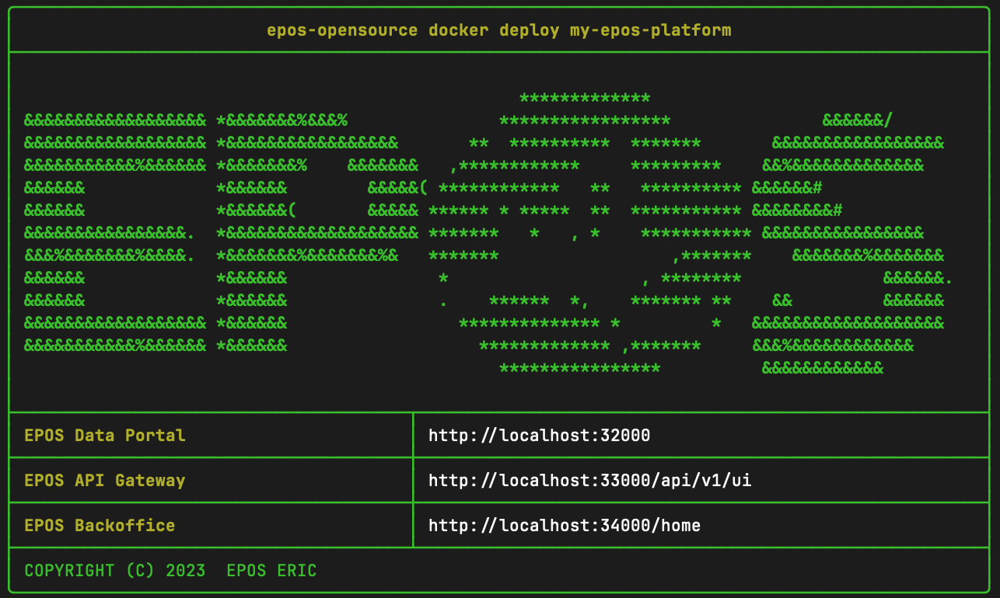

This guide shows you the fastest way to install and try the EPOS Platform. Once you are familiar, you can explore other installation options.

## Requirements

- Linux or macOS with at least 4GB RAM, 2 CPU cores, and 10GB free storage
- [Docker](https://docs.docker.com/get-started/get-docker/) installed and running
- Internet connection

---

## Installation

### Step 1: Install the CLI

```bash
curl -fsSL https://raw.githubusercontent.com/epos-eu/epos-opensource/main/install.sh | bash
```

### Step 2: Verify installation

```bash
epos-opensource --version
```

Expected output (version may vary):

```text
epos-opensource version v0.2.4
```

### Step 3: Deploy the system

:::note

Make sure Docker is running before you continue.

:::

Run the following command, replacing `my-epos-platform` with any name you prefer:

```bash
epos-opensource docker deploy my-epos-platform
```

This will start an EPOS Platform environment locally using Docker Compose. At the end, you will see the access URLs.


 

### Step 4: Populate with sample data

Once the environment is running, populate it with example metadata:

```bash
epos-opensource docker populate my-epos-platform ./my_sample_data   
```


---

## Access the web interface

Open the `Data Portal` URL shown after the deployment step in your browser. The default URL is [http://localhost:32000/](http://localhost:32000/)

The Example Metadata is on the top-left side of the `Data Portal`, it might take a few seconds to show.
In the case that the data does not show try stopping and restarting the ingestor-service

```bash
docker stop my-epos-platform-ingestor-service
docker start my-epos-platform-ingestor-service
```
Give it a few seconds and refresh the page

### What you'll see

- **Data Portal**: Main interface for browsing and searching geospatial services
- **Service Catalog**: View available web services and their metadata
- **Interactive Maps**: Preview geospatial data on interactive maps
- **API Documentation**: Access the REST API documentation at `http://localhost:33000/api/v1/ui ` 

### Next Steps

Now that you have EPOS Platform running:

1. **[Getting Started](./user-guide.md)** - Learn how to use the platform features
2. **[Installation Overview](./installation/installation.md)** - Explore advanced deployment options
3. **[System Architecture](/architecture/architecture.md)** - Understand the system design
