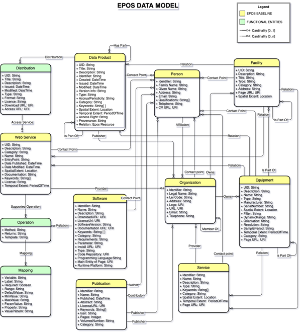

import MermaidFullscreen from '@site/src/components/MermaidFullscreen';

# EPOS Data Model

The EPOS Data Model defines the structure of the information provided by the system to the end user. The Model’s components of the model are accessible through appropriate interfaces (e.g. web APIs) and they implement specific functionalities. In particular, they represent a guideline to define inputs and outputs of different system components.

The EPOS Data Model defines the structure of the information provided by the system to the end user. The Model’s components are accessible through appropriate interfaces (e.g. web APIs) and they implement specific functionalities. In particular, they offer guidelines to define inputs and outputs of different system components.

<MermaidFullscreen
title="EPOS Data Model"
chart={`

classDiagram
direction LR
class Distribution {
+UID string
+Title string
+Description string
+Issued DateTime
+Modified DateTime
+Format string
+License string
+AccessURL URL
+DownloadURL URL
}
class WebService {
+UID string
+Title string
+Category string
+Description string
+Issued DateTime
+Modified DateTime
+Documentation URL
+Endpoint URL
+License string
+Keywords string
+TemporalExtent PeriodOfTime
}
class Operation {
+Method string
+Returns string
+Name string
+Template string
}
class Mapping {
+Variable string
+Source string
+Range string
+MappingRef string
+MappingValue string
+MappingUnit string
+Property string
+ValueOrPattern string
}
class DataProduct {
+UID string
+Title string
+Description string
+Identifier string
+Created DateTime
+Issued DateTime
+Modified DateTime
+Version string
+Type string
+Keyword string
+AccessRight string
+Provenance string
+Relation string
}
class Software {
+Identifier string
+Name string
+Description string
+Version string
+License string
+SourceRepository URL
+Documentation URL
+ProgrammingLanguage string
+RuntimePlatform string
}
class Publication {
+Identifier string
+Title string
+Author string
+Issued DateTime
+Abstract string
+Keyword string
+License string
+Category string
}
class Person {
+Identifier string
+GivenName string
+FamilyName string
+Email string
+ORCID string
+Telephone string
+CVURL URL
}
class Organization {
+Identifier string
+LegalName string
+Acronym string
+Address string
+Email string
+URL URL
+Telephone string
}
class Facility {
+UID string
+Title string
+Description string
+Category string
+Type string
+SpatialExtent string
}
class Equipment {
+UID string
+Title string
+Description string
+Name string
+Type string
+Manufacturer string
+SerialNumber string
+SpatialExtent string
+TemporalExtent PeriodOfTime
}
class Service {
+Identifier string
+Title string
+Description string
+Category string
+Type string
+SpatialExtent string
+TemporalExtent PeriodOfTime
+PageURL URL
}
Distribution "many" <-- "many" WebService : Access Service
WebService "1" --> "many" Operation : Supported Operations
Operation "1" --> "many" Mapping : Mapping
DataProduct "1" --> "many" Distribution : Distribution
DataProduct "many" --> "many" Publication : Publisher
DataProduct "many" --> "many" Person : Contact Point
Organization "1" --> "many" DataProduct : Provider
Software "many" --> "many" Person : Contact Point
Publication "many" --> "many" Person : Author
Person "many" --> "many" Organization : Affiliation / Member Of
Organization "many" --> "many" Person : Contact Point / Owns
Organization "1" --> "many" Facility : Is Part Of
Facility "1" --> "many" Equipment : Is Part Of
Organization "1" --> "many" Service : Provider
Equipment "many" --> "many" Person : Contact Point
Service "many" --> "many" Person : Contact Point
style Distribution fill:#d9f2d9,stroke:#006600,stroke-width:2px
style WebService fill:#d9f2d9,stroke:#006600,stroke-width:2px
style Operation fill:#d9f2d9,stroke:#006600,stroke-width:2px
style Mapping fill:#d9f2d9,stroke:#006600,stroke-width:2px
style DataProduct fill:#fff7b2,stroke:#d4aa00,stroke-width:2px
style Software fill:#f2f2f2,stroke:#333,stroke-width:1px
style Publication fill:#f2f2f2,stroke:#333,stroke-width:1px
style Person fill:#f2f2f2,stroke:#333,stroke-width:1px
style Organization fill:#fff7b2,stroke:#d4aa00,stroke-width:2px
style Facility fill:#fff7b2,stroke:#d4aa00,stroke-width:2px
style Equipment fill:#fff7b2,stroke:#d4aa00,stroke-width:2px
style Service fill:#fff7b2,stroke:#d4aa00,stroke-width:2px
class Distribution:::functional
class WebService:::functional
class Operation:::functional
class Mapping:::functional
class DataProduct:::baseline
class Software:::neutral
class Publication:::neutral
class Person:::neutral
class Organization:::baseline
class Facility:::baseline
class Equipment:::baseline
class Service:::baseline
classDef Pine :,stroke-width:1px, stroke-dasharray:none, stroke:#254336, fill:#27654A, color:#FFFFFF
`}
/>

The EPOS data model was discussed and defined in EPOS-IP as of 2018 in the document “Second (Final) Report on EPOS-ICS Architecture” and is here reported for reader’s convenience in the following class diagram.

The EPOS Data model includes the following concepts:

- Person
- Equipment
- Facility
- Service
- Web service
- Organization
- Data
- Software and mode code
- Publication

The data model defines the objects that the user will have to deal with in the EPOS ecosystem. Therefore, the User experience and associated functionalities implemented by the system modules must adhere to the data structure defined in the model.

<a href="./Documents/EPOS_DATA_MODEL.pdf" download="EPOS_DATA_MODEL.pdf">**Download EPOS Data Model PDF**</a>
